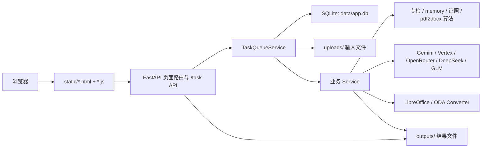
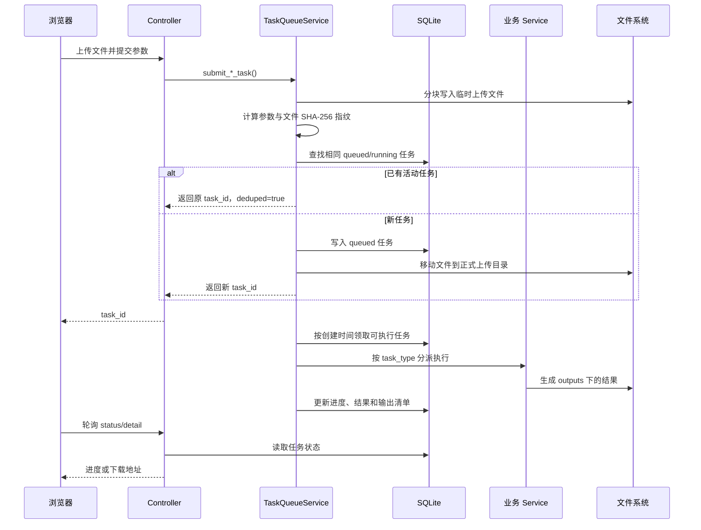

# FastAPI LLM 文档处理工作台——项目结构分析

> 分析基准：2026-07-14 当前工作区代码。本文只描述实际存在的目录、入口和调用关系；`uploads/`、`outputs/`、`data/` 等运行时目录中的具体文件不纳入源码结构分析。

## 1. 项目定位

本项目是一个以 FastAPI 为后端、原生 HTML/CSS/JavaScript 为前端的 AI 文档处理工作台。它把多套原本相对独立的文档算法整合到同一个 Web 应用中，并通过统一任务队列提供上传、排队、进度查询、取消、下载、批量操作和异常反馈能力。

当前统一接入了 9 类后台任务：

1. `number_check`：双语文档数字一致性专检；
2. `zhongfanyi`：中翻专检；
3. `alignment`：原文与译文多语对照；
4. `drivers_license`：驾驶证图片识别与翻译；
5. `doc_translate`：通用证件/文档 OCR 与多语翻译；
6. `business_licence`：营业执照识别、翻译和 Word 套版；
7. `pdf2docx`：PDF/图片 OCR 后生成可编辑 Word；
8. `word_count`：Office、PDF、图片和 CAD 文件字数统计；
9. `msg_convert`：Outlook `.msg` 邮件转 Word/PDF。

项目采用“单体 Web 应用 + 本地持久化任务队列”的形态：API、队列调度、算法执行、SQLite 数据库和静态页面都运行在同一个应用进程/容器内，没有独立的 Celery、Redis 或消息中间件。

## 2. 技术栈

| 层级 | 主要技术 | 用途 |
| --- | --- | --- |
| Web 后端 | Python 3.11、FastAPI、Uvicorn | 页面、API、文件上传与下载 |
| 参数与配置 | Pydantic、pydantic-settings、python-dotenv | 请求校验及 `.env` 配置加载 |
| 数据访问 | SQLAlchemy 2、SQLite | 任务状态、参数、输入输出和反馈记录 |
| 前端 | 原生 HTML、CSS、JavaScript | 工作台页面及 Fetch API 调用 |
| 大模型 | Google Gemini/Vertex AI、OpenRouter、DeepSeek、智谱 GLM | OCR、翻译、对齐和 AI 复核 |
| Office 文档 | python-docx、openpyxl、python-pptx、LibreOffice | DOC/DOCX/XLS/XLSX/PPT/PPTX 解析与转换 |
| PDF/图像 | PyMuPDF、pdfplumber、pdfminer、Pillow、OpenCV | PDF 解析、渲染、OCR 前处理 |
| 邮件 | extract-msg、BeautifulSoup | MSG 正文、内嵌图片和附件处理 |
| CAD | ezdxf、可选 ODA File Converter | DXF 解析及 DWG/DWS/DWT 转换 |
| 部署 | Docker、Docker Compose、Nginx | 单容器应用和反向代理部署 |
| 测试 | pytest | 服务、接口和文件处理回归测试 |

## 3. 总体架构



各层职责如下：

- `app/main.py`：应用装配、生命周期、静态目录挂载和页面渲染；
- `app/controller/task.py`：HTTP 接口、请求校验和下载响应；
- `app/service/task_queue_service.py`：任务提交、去重、排队、并发限制、分派和状态收口；
- `app/service/*_service.py`：不同业务的适配层，把统一任务参数转换为底层算法调用；
- `app/repository/task_repo.py`：集中封装任务表的增删改查；
- `app/model/entity.py`：SQLAlchemy 任务实体；
- `专检/`、`memory/`、`businesslicence/`、`Driver's_License/`、根目录 `pdf2docx.py`：具体算法实现；
- `static/`：前端页面和脚本；
- `uploads/`、`outputs/`、`data/`：运行时持久化数据。

## 4. 目录结构

下面的目录树省略了 `.git/`、`.venv/`、IDE 配置、缓存、日志及大量运行时产物。

```text
fastapi-llm-demo/
├─ app/                         # Web 应用主体
│  ├─ main.py                   # FastAPI 入口、页面路由、生命周期
│  ├─ controller/
│  │  └─ task.py                # /task 下的全部业务 API
│  ├─ core/
│  │  ├─ config.py              # 环境变量与派生配置
│  │  ├─ file_naming.py         # 展示编号、存储名、下载名生成
│  │  ├─ request_context.py     # 当前请求客户端 IP 上下文
│  │  └─ task_model_display.py  # 任务所用模型的展示信息
│  ├─ db/
│  │  ├─ database.py            # SQLite 引擎、SessionLocal、Base
│  │  ├─ init_db.py             # 建表与兼容旧库的增量补列
│  │  └─ session.py             # 数据库会话导出
│  ├─ model/
│  │  ├─ entity.py              # Task ORM 实体
│  │  └─ dto.py                 # 少量 Pydantic DTO
│  ├─ repository/
│  │  └─ task_repo.py           # 任务持久化仓储
│  └─ service/                   # 队列及各业务服务适配层
├─ static/                      # 原生前端页面、脚本和公共样式
├─ 专检/
│  ├─ 数检_程序-AIV2/           # 数字专检算法主版本
│  └─ 中翻译/                   # 中翻规则、LLM 检查、解析与写回
├─ memory/
│  └─ memory.py                 # 大型多语对照/语料处理算法
├─ businesslicence/
│  ├─ start2.py                 # 营业执照识别和 Word 套版旧入口
│  └─ template/                 # 营业执照 Word 模板
├─ Driver's_License/
│  ├─ run.py                    # 驾驶证独立运行入口
│  ├─ src/                      # OCR、字段解析、翻译、文档生成流水线
│  └─ jsz_translated/           # 新旧版驾驶证 Word 模板
├─ pdf2docx.py                  # OCR/PDF/图片转 Word 底层实现
├─ tests/                       # pytest 回归测试
├─ scripts/                     # LLM 路由和代理连通性测试脚本
├─ deploy/nginx/                # Nginx 反向代理模板
├─ data/                        # SQLite 与运行时数据
├─ uploads/                     # 已接收的输入文件
├─ outputs/                     # 任务输出结果
├─ temp_images/                 # 图像处理中间文件
├─ tmp/                         # 临时处理目录
├─ Dockerfile                   # Python 3.11 + LibreOffice 运行镜像
├─ docker-compose.yml           # 应用、Nginx、卷和环境变量编排
├─ requirements.txt             # Python 依赖
├─ env.example                  # 环境变量模板
└─ pytest.ini                   # pytest 路径与临时目录配置
```

### 4.1 源码目录与运行时目录的边界

| 类型 | 目录 | 说明 |
| --- | --- | --- |
| 应用源码 | `app/`、`static/` | Web 层、任务层和页面 |
| 算法源码 | `专检/`、`memory/`、`businesslicence/`、`Driver's_License/`、`pdf2docx.py` | 文档处理核心能力 |
| 模板资源 | `businesslicence/template/`、`Driver's_License/jsz_translated/` | 输出 Word 所需模板 |
| 配置部署 | `env.example`、`Dockerfile`、`docker-compose.yml`、`deploy/` | 环境和发布配置 |
| 运行时数据 | `data/`、`uploads/`、`outputs/`、`temp_images/`、`tmp/` | 不应作为源码提交或打包分析对象 |
| 开发验证 | `tests/`、`scripts/` | 自动测试和人工连通性检查 |

## 5. `app/` 后端结构详解

### 5.1 应用入口：`app/main.py`

`app.main:app` 是 Uvicorn 的启动对象，负责：

- 创建 FastAPI 应用并配置 CORS；
- 通过中间件记录客户端 IP，供创建任务时写入数据库；
- 挂载 `/static`、`/uploads`、`/outputs`、`/temp_images`；
- 注册 `app.controller.task` 中的 `/task` 路由；
- 启动时初始化 SQLite 并启动任务队列；
- 关闭时停止调度器并等待/清理执行资源；
- 提供 `/healthz` 健康检查；
- 读取 `static/*.html`，动态注入统一导航、版本号和静态资源缓存参数。

页面并未使用模板引擎或前端框架。每个功能通常由一个 HTML 和一个同名 JavaScript 文件组成，后端读取 HTML 字符串后再注入统一应用外壳。

### 5.2 控制器：`app/controller/task.py`

这是项目唯一的主业务路由模块，路由前缀为 `/task`。它主要做四类工作：

1. 校验文件类型、数量、大小和请求参数；
2. 调用 `TaskQueueService.submit_*_task()` 创建任务；
3. 查询任务、统计、日志、取消和异常反馈；
4. 校验输出路径后返回单文件或 ZIP 下载。

控制器不直接执行耗时算法。正常提交接口只完成文件暂存和任务登记，然后快速返回 `task_id`，由前端轮询对应的状态接口。

### 5.3 核心工具：`app/core/`

- `config.py`：从根目录 `.env` 和操作系统环境变量读取大模型、队列、文件目录、字数统计白名单、代理和 CAD 配置；
- `file_naming.py`：区分内部存储文件名与用户可见文件名，生成 `YYYYMMDD-000001` 格式展示编号并处理重名；
- `request_context.py`：使用 `ContextVar` 保存当前请求 IP，避免在队列提交链路中层层传参；
- `task_model_display.py`：从任务参数中归一化模型名，供工作台展示。

### 5.4 数据库：`app/db/`、`app/model/`、`app/repository/`

数据库固定为根目录 `data/app.db`。`database.py` 创建 SQLAlchemy 引擎，SQLite 使用 `check_same_thread=False` 以便队列线程访问。

当前只有一张核心表 `task`。重要字段可以分为：

- 标识：`id`、`task_id`、`display_no`、`task_type`、`task_label`；
- 状态：`status`、`progress`、`message`、`error_message`、`retry_count`、`cancel_requested`；
- 输入：`filename`、`client_ip`、`params_json`、`input_files_json`；
- 去重：`request_fingerprint`、`file_fingerprints_json`；
- 批次：`batch_id`、`batch_name`、`batch_index`、`batch_total`；
- 输出：`output_path`、`output_files_json`、`result_json`；
- 反馈：`feedback_marked`、`feedback_category`、`feedback_note`、`feedback_marked_at`；
- 时间：`created_at`、`updated_at`、`started_at`、`finished_at`。

`task_repo.py` 封装了任务创建、抢占、更新进度、完成、失败、取消、反馈、分页查询和统计。队列使用带状态条件的 `UPDATE` 抢占任务，避免同一个排队任务在同一数据库上被重复领取。

`init_db.py` 在启动时执行 `create_all()`，并通过检查字段后执行 `ALTER TABLE` 的方式兼容旧数据库；当前没有使用 Alembic 等正式迁移工具。

### 5.5 统一任务队列：`app/service/task_queue_service.py`

`TaskQueueService` 是 Web 层与所有算法之间的中心调度器，其处理过程为：



队列实现的关键能力：

- 上传文件按块读取，避免一次性把大文件全部读入内存；
- 用“任务类型 + 归一化参数 + 文件名/大小/SHA-256”生成请求指纹，只对 `queued`/`running` 任务去重；
- 总并发数由 `TASK_QUEUE_MAX_CONCURRENT_TASKS` 控制，默认 2；
- 同时支持每类任务的独立并发上限；数字专检和中翻专检共用 `specialist_text` 分组，组合并发上限为 1；
- 同步重计算可进入 `ThreadPoolExecutor`，避免直接阻塞 FastAPI 事件循环；
- 应用重启后把中断的 `running` 任务自动重新排队，默认最多自动重试 1 次；
- 取消属于协作式取消，在进度回调或任务结束前检查 `cancel_requested`；
- 统一提取算法返回的输出路径，写入 `output_files_json` 供单个或批量下载。

任务状态流转为：

```text
queued → running → done
              ├─→ failed
              └─→ cancelled
queued ──────────→ cancelled
```

流式日志保存在队列实例内存中，最多保留约 50,000 个字符；数据库只持久化当前消息、错误和结果，因此应用重启后详细流式日志不会恢复。

## 6. 业务服务映射

| 任务类型 | 前端页面 | API 主入口 | Service | 底层实现/外部依赖 | 主要输出 |
| --- | --- | --- | --- | --- | --- |
| `number_check` | `number_check.html/js` | `POST /task/number-check` | `number_check_service.py` | `专检/数检_程序-AIV2/main.py`、LibreOffice、LLM | 修订文档、Excel/JSON 报告 |
| `zhongfanyi` | `zhongfanyi.html/js` | `POST /task/zhongfanyi` | `zhongfanyi_service.py` | `专检/中翻译/main.py`、规则文件、LLM | 修订文档、分区报告 |
| `alignment` | `alignment.html/js` | `POST /task/alignment` | `alignment_service.py` | `memory/memory.py`、LLM、Office 解析 | 双语对照 Excel |
| `drivers_license` | `drivers_license.html/js` | `POST /task/drivers-license` | `drivers_license_service.py` | `Driver's_License/src/`、GLM、DeepSeek | 翻译版 Word |
| `doc_translate` | `doc_translate.html/js` | `POST /task/doc-translate` | `doc_translate_service.py` | `pdf2docx.py`、Gemini/OpenRouter、LibreOffice | OCR 文本及多语翻译文件 |
| `business_licence` | `business_licence.html/js` | `POST /task/business-licence` | `business_licence_service.py` | `businesslicence/start2.py`、Word 模板、视觉模型 | 套版 Word |
| `pdf2docx` | `pdf2docx.html/js` | `POST /task/pdf2docx` | `pdf2docx_service.py` | `pdf2docx.py`、聊天/网页保版服务 | 可编辑 Word、布局 JSON |
| `word_count` | `word_count.html/js` | `POST /task/word-count` | `word_count_service.py` | Office/PDF 解析、OCR、CAD 服务 | 统计 Excel、OCR 文本包 |
| `msg_convert` | `msg_convert.html/js` | `POST /task/msg-convert` | `msg_convert_service.py` | extract-msg、HTML 清理、LibreOffice | Word、PDF 或两者 |

### 6.1 共用基础服务

- `gemini_service.py`：统一 Google、Vertex AI 和 OpenRouter 路由，提供文本/视觉模型调用；
- `libreoffice_service.py`：处理旧版 Office 文件和 Word/PDF 转换；
- `ocr_text_service.py`：复用根目录 `pdf2docx.py` 的 OCR 能力并提取纯文本；
- `cad_text_service.py`：直接解析 DXF；DWG、DWS、DWT 先通过 ODA File Converter 转换；
- `chat_preserve_docx_service.py`：识别聊天截图结构并尽量保留头像、气泡和图片资产；
- `web_asset_preserve_docx_service.py`：识别网页截图中的文本和重要图片，生成可编辑 Word。

### 6.2 专检模块的集成方式

两套专检代码不是普通的、完全隔离的 Python 包。Service 会在运行时设置环境变量、调整 `sys.path`/`sys.modules`、注册兼容命名空间，再调用其主入口。数字专检和中翻专检还共享部分历史模块名，因此队列把它们放入同一个并发组，避免并行导入和全局状态互相污染。

数字专检自身的详细提取、检查、修订写回流程见 `专检/数检_程序-AIV2/ARCHITECTURE.md`。

## 7. 页面与 API 组织

### 7.1 页面路由

| 页面路由 | 页面文件 | 说明 |
| --- | --- | --- |
| `/` | `static/nav.html` | 首页/工具导航 |
| `/dashboard` | `static/dashboard.html` | 任务列表、统计、反馈和批量操作 |
| `/certificate-translation` | `static/certificate_translation.html` | 证件翻译聚合页 |
| `/number-check` | `static/number_check.html` | 数字专检 |
| `/zhongfanyi` | `static/zhongfanyi.html` | 中翻专检 |
| `/alignment` | `static/alignment.html` | 多语对照 |
| `/drivers-license` | `static/drivers_license.html` | 驾驶证翻译 |
| `/doc-translate` | `static/doc_translate.html` | 通用文档翻译 |
| `/business-licence/embed` | `static/business_licence.html` | 营业执照嵌入页 |
| `/business-licence` | 重定向 | 跳转到证件翻译聚合页的营业执照标签 |
| `/pdf2docx` | `static/pdf2docx.html` | 文档预处理 |
| `/msg-convert` | `static/msg_convert.html` | MSG 转文档 |
| `/word-count` | `static/word_count.html` | 字数统计 |

### 7.2 通用任务 API

- `GET /task/list`：分页、状态、类型、关键字和异常标记筛选；
- `GET /task/dashboard/stats`：任务状态和类型统计；
- `GET /task/{task_id}/detail`：任务详情和当前内存日志；
- `POST /task/{task_id}/cancel`：取消单任务；
- `POST /task/{task_id}/feedback`：标记/取消标记异常并记录说明；
- `GET /task/{task_id}/download`：下载任务输出文件；
- `POST /task/batch-download`、`POST /task/batch-cancel`：按任务列表批量处理；
- `GET /task/batch/{batch_id}/download`、`POST /task/batch/{batch_id}/cancel`：按批次处理。

每个业务通常提供 `config`、`submit` 和 `status/{task_id}` 三类接口；支持多文件的文档翻译、PDF 转 Word 和 MSG 转换另有 `batch` 接口，字数统计另有 `upload` 接口，中翻专检另有规则读写接口。

## 8. 文件与数据流

### 8.1 输入文件

上传文件先写入：

```text
uploads/_tmp_uploads/<task_type>/
```

任务记录预留成功后，再移动到正式任务上传目录。数据库的 `input_files_json` 保存各输入角色对应的路径和原始文件名，例如原文、译文、对照表、规则文件或多张图片。

字数统计还支持服务器目录/UNC 共享目录作为输入。此模式受 `WORD_COUNT_ALLOWED_ROOTS_JSON` 白名单约束，并可通过 `WORD_COUNT_UNC_MOUNT_MAP_JSON` 把 Windows UNC 路径映射到容器内挂载目录。

### 8.2 输出文件

各业务一般写入：

```text
outputs/<task_type>/<display_no>/
```

不同历史模块的内部目录可能略有差异，队列最终会把可下载文件归一化到 `output_files_json`。控制器下载文件前会解析并校验真实路径，批量下载时生成 ZIP，并处理重名和旧版文件名前缀。

### 8.3 数据持久化范围

| 数据 | 持久化位置 | 重启后是否保留 |
| --- | --- | --- |
| 任务状态/参数/结果索引 | `data/app.db` | 是 |
| 上传原文件 | `uploads/` | 是，取决于部署卷 |
| 输出文件 | `outputs/` | 是，取决于部署卷 |
| 详细流式日志 | 应用内存 | 否 |
| 正在执行的 Python 协程/线程 | 应用内存 | 否；重启后按数据库状态重排 |

## 9. 配置体系

配置入口是根目录 `.env`，示例见 `env.example`。主要分组如下：

| 分组 | 代表配置 |
| --- | --- |
| 大模型密钥 | `GOOGLE_API_KEY`、`OPENROUTER_API_KEY`、`DEEPSEEK_API_KEY`、`GLM_API_KEY` |
| Gemini/Vertex | `GEMINI_DEFAULT_ROUTE`、`GEMINI_TIMEOUT_SECONDS`、`VERTEX_PROJECT_ID`、`VERTEX_LOCATION` |
| Web 服务 | `HOST`、`PORT`、`DEBUG`、`ALLOWED_ORIGINS` |
| 文件目录 | `UPLOAD_DIR`、`OUTPUT_DIR`、`TEMP_IMAGES_DIR` |
| 队列 | `TASK_QUEUE_MAX_CONCURRENT_TASKS`、`TASK_QUEUE_EXECUTOR_MAX_WORKERS`、`TASK_QUEUE_TYPE_LIMITS_JSON` |
| 字数统计 | `WORD_COUNT_ALLOWED_ROOTS_JSON`、UNC 映射、文件数/大小限制、OCR 开关 |
| CAD | `ODA_FILE_CONVERTER_PATH`、`WORD_COUNT_CAD_CONVERT_TIMEOUT_SECONDS` |
| MSG | `MSG_CONVERT_UPLOAD_MAX_MB` |
| 外部程序 | `LIBREOFFICE_PATH`、代理相关环境变量 |

`.env` 含密钥，不应提交到 Git。`config.py` 会优先保留已有系统环境变量，再加载 `.env`；代理变量会按 `.env` 内容进行显式覆盖或清除。

## 10. 启动与部署

### 10.1 本地启动

```powershell
python -m venv .venv
.\.venv\Scripts\Activate.ps1
pip install -r requirements.txt
Copy-Item env.example .env
# 编辑 .env，填写实际密钥和外部程序路径
python -m uvicorn app.main:app --host 0.0.0.0 --port 8001 --reload
```

访问：

- 工作台：`http://127.0.0.1:8001/`
- OpenAPI：`http://127.0.0.1:8001/docs`
- 健康检查：`http://127.0.0.1:8001/healthz`

### 10.2 Docker Compose

```powershell
docker compose up -d --build
docker compose logs -f fastapi-llm
```

部署链路为：

```text
客户端 → Nginx:80 → fastapi-llm:8001 → FastAPI/队列/SQLite
```

Compose 默认把 `data/`、`uploads/`、`outputs/`、`temp_images/` 和营业执照输入输出目录挂载为持久卷，并预留 Windows 共享目录到 `/mnt/win-server/...` 的只读挂载。Nginx 上传上限为 100 MB，代理读写超时为 300 秒；各业务还会执行自己的文件数量和大小校验。

镜像内安装了 LibreOffice 和 Noto CJK 字体。ODA File Converter 未在 Dockerfile 中自动安装，CAD 的 DWG/DWS/DWT 支持需要额外提供该程序；DXF 可由 `ezdxf` 直接解析。

## 11. 测试结构

`pytest.ini` 指定 `tests/` 为测试目录，并把临时目录放在 `data/pytest/tmp`。当前测试重点覆盖：

- 任务提交指纹去重、批次信息和客户端 IP；
- 单个/批量下载文件名；
- 数字专检新版模块集成；
- PDF 转 Word 的布局模式；
- MSG 解析、HTML/RTF 回退、内嵌图片、安全校验和 API；
- 字数统计的多格式提取、OCR、UNC 映射、上传和 API；
- CAD 文本提取及 ODA 异常处理；
- 聊天截图和网页截图保版 Word；
- 多语对照文本覆盖率修复。

执行全部测试：

```powershell
python -m pytest
```

只执行某一模块：

```powershell
python -m pytest tests/test_task_submit_dedupe.py -q
```

## 12. 当前结构的优点

- 所有功能共用一套任务表、状态接口、下载和工作台，用户体验一致；
- Service 适配层把 Web/队列逻辑与历史算法入口隔开，底层算法可以逐步重构；
- 上传暂存、内容指纹去重、文件名规范化和路径校验已经集中处理；
- 队列同时提供总并发、任务类型并发和共享资源组限制，适合本地重计算场景；
- 输入、输出和 SQLite 均可通过 Docker 卷持久化；
- 对字数统计的目录白名单、UNC 映射和大批文件限制考虑较完整；
- 测试已覆盖多个高风险文档格式和任务调度边界。

## 13. 主要维护风险与建议

以下结论来自当前代码结构，按优先级排列。

### 13.1 队列只适用于单进程部署

任务调度器、运行计数和流式日志都在进程内存中。当前 Compose 只启动一个 Uvicorn 进程，与实现匹配；如果直接增加 `--workers` 或水平扩容多个应用容器，各进程会各自启动调度器，SQLite 抢占虽然能减少重复领取，但并发上限、共享资源锁和日志仍无法全局一致。

建议：保持单进程，或在扩容前把队列迁移到 Redis/Celery、RQ、Dramatiq 等外部系统，并把日志放入持久化存储。

### 13.2 专检模块依赖全局导入状态

专检 Service 会修改 `sys.path`、`sys.modules` 和部分环境变量，说明历史算法还没有形成稳定、隔离的包接口。当前共享并发组能规避一部分冲突，但后续新增专检功能时必须继续评估模块名和全局状态冲突。

建议：逐步为两套专检建立独立包命名空间和纯函数入口，显式传递配置，减少运行时注入。

### 13.3 核心文件体量较大、职责集中

`app/main.py` 内嵌了大量应用外壳 CSS/HTML，`controller/task.py` 集中了所有接口，`task_queue_service.py` 同时负责上传、去重、调度和结果归一化，多个业务 Service 也包含大量解析细节。

建议：按业务拆分 Router；把页面外壳移到静态模板；将队列拆为“提交/存储”“调度”“执行器注册表”“输出归一化”几个组件。

### 13.4 数据库迁移和字段结构可继续规范

当前通过启动时手写 `ALTER TABLE` 补列，复杂参数和结果大量以 JSON 文本保存在单表中。该方案部署简单，但字段演进、查询统计和失败回滚能力有限。

建议：引入 Alembic；为高频查询字段建立正式迁移；如任务规模增长，再评估 PostgreSQL 和独立任务附件表。

### 13.5 外部访问边界需要部署层保护

应用代码中未见登录鉴权，默认 CORS 为 `*`，并直接挂载 `/uploads` 和 `/outputs` 静态目录。若服务暴露到不可信网络，需要防止未授权查看任务和文件。

建议：在 Nginx/网关增加认证和访问控制，生产环境收紧 CORS，并评估是否取消上传目录的直接静态暴露，统一改为鉴权下载接口。

### 13.6 目录命名存在兼容分支

本地目录名为 `Driver's_License`，Dockerfile 会复制到镜像内的 `Drivers_License`。`drivers_license_service.py` 同时兼容两种名称，但会增加部署排查成本。

建议：统一为不含撇号的 `Drivers_License`，并同步更新 Dockerfile、文档和引用路径。

### 13.7 `.gitignore` 的测试规则需要整理

当前 `.gitignore` 同时包含 `tests/*` 和 `tests/`，只显式放行了一个测试文件。已经被 Git 跟踪的旧测试仍会正常存在，但新增测试容易被忽略而未提交。

建议：删除忽略整个 `tests/` 的规则，只忽略测试缓存和生成产物。

## 14. 新功能接入建议

新增一种后台工具时，建议遵循以下落点：

1. 在 `app/service/<feature>_service.py` 中提供清晰的 `execute_*_task()` 入口；
2. 在 `TaskQueueService` 中增加提交方法、输入字段校验、执行分派和输出文件归一化；
3. 在 `task_repo.TASK_TYPE_LABELS` 中增加用户可见名称；
4. 在 `app/controller/task.py` 中增加 `config/submit/status` 路由；
5. 在 `static/` 中增加页面和脚本，并在 `app/main.py` 注册页面及导航；
6. 在 `env.example`、Dockerfile/Compose 中补充配置和外部依赖；
7. 增加 Service 单元测试、任务去重测试、API 提交测试和输出下载测试；
8. 若任务使用全局模型配置、进程级缓存或非线程安全库，为它配置独立并发上限或共享资源组。

## 15. 阅读代码的推荐顺序

第一次接手项目时，建议按以下顺序阅读：

1. `app/main.py`：了解应用启动、页面和生命周期；
2. `app/controller/task.py`：了解对外功能和请求格式；
3. `app/service/task_queue_service.py`：理解任务如何进入、执行和结束；
4. `app/model/entity.py`、`app/repository/task_repo.py`：理解状态持久化；
5. 目标业务对应的 `app/service/*_service.py`；
6. Service 指向的 `专检/`、`memory/`、证照模块或 `pdf2docx.py`；
7. 对应的 `static/*.js` 和 `tests/test_*.py`；
8. 最后阅读 Docker、Nginx 和 `.env` 配置，确认生产运行边界。
